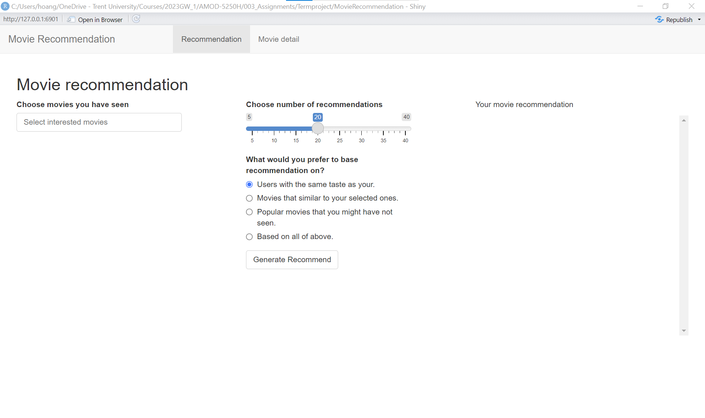
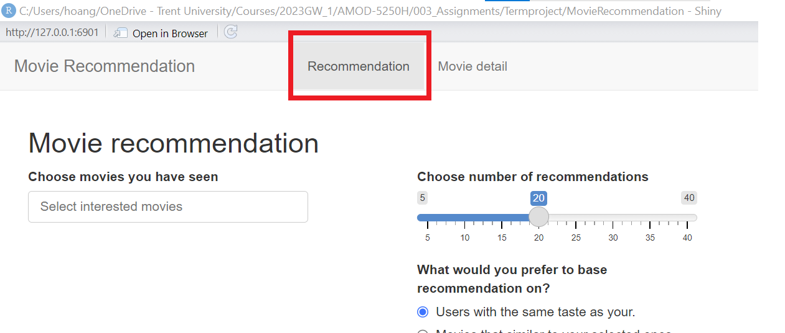
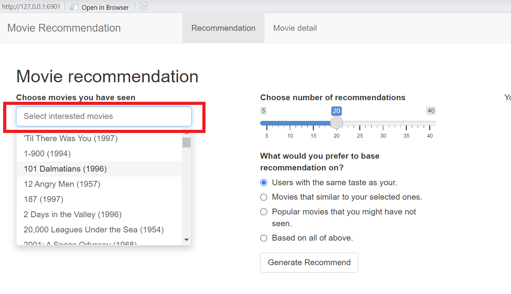
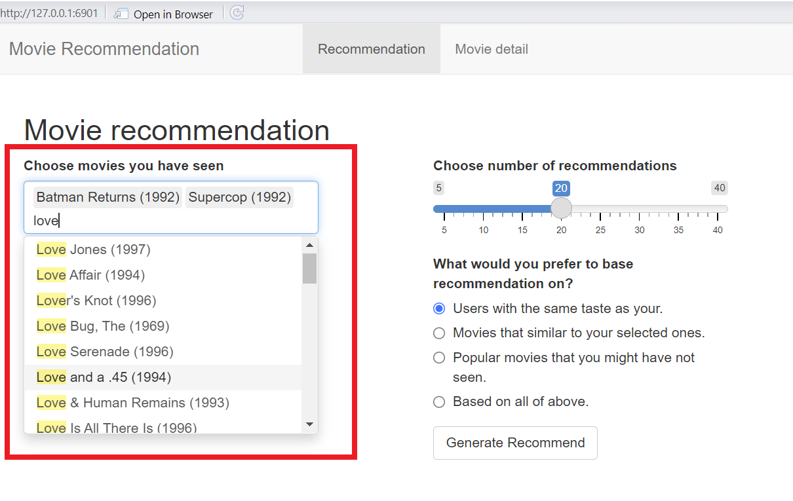
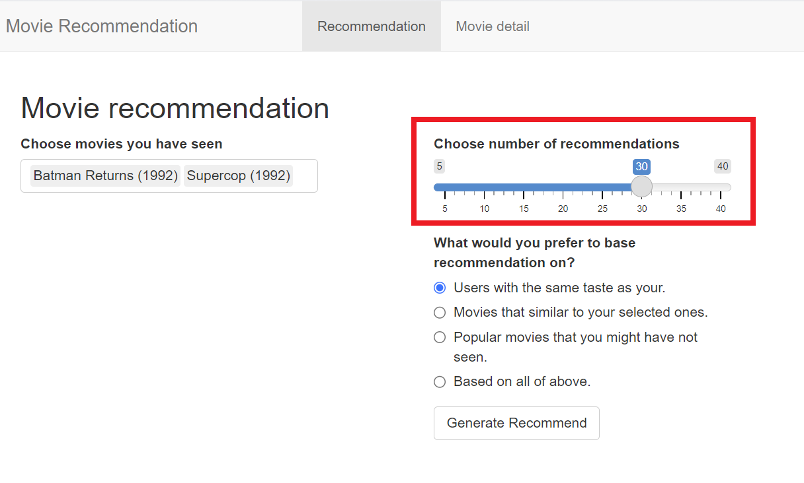
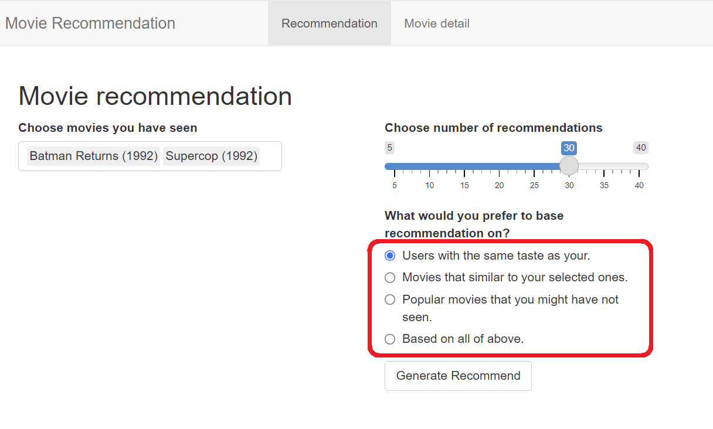
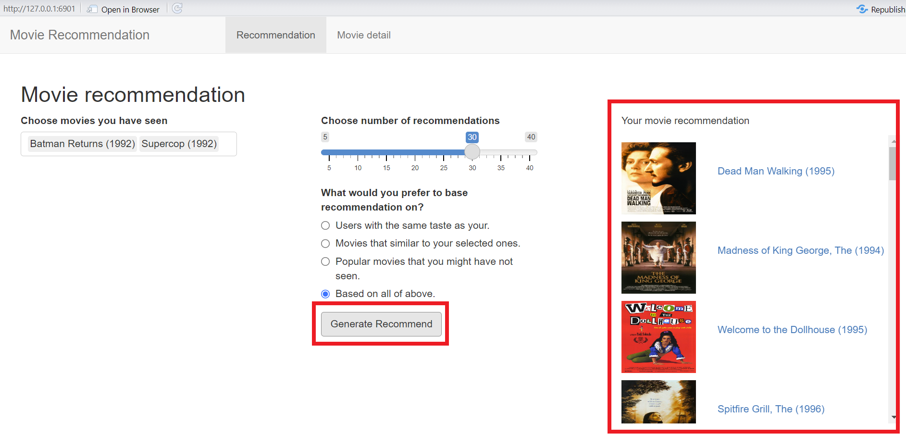
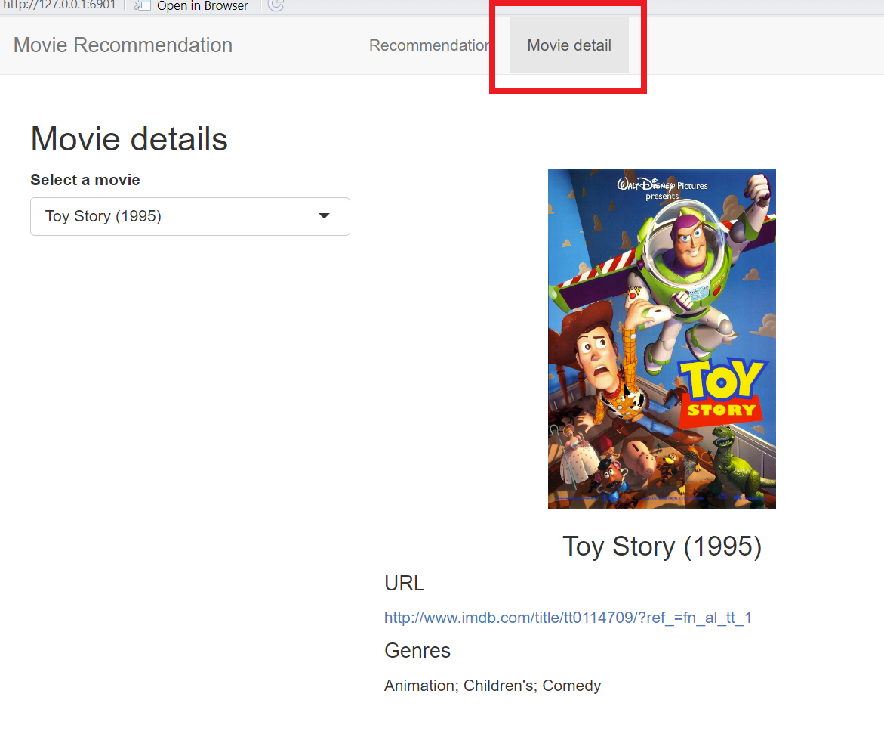
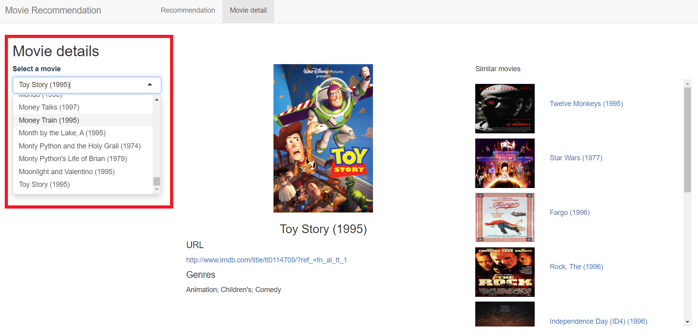
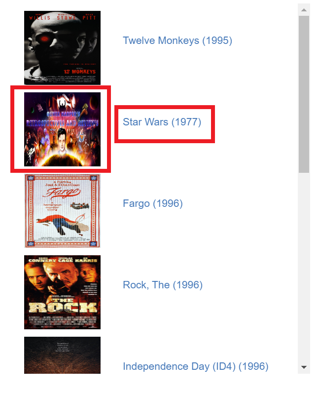

# Instruction

## Getting started

### Run from pre-installed application

The application is available at the following URL and can be accessed via most of the popular web browsers:

    https://haithanhhoang.shinyapps.io/MovieRecommendation/

### Run from sourcecode

#### Prerequisites

The following softwares and modules are required:

- git: Installation manual is available at [Installing Git]( https://git-scm.com/book/en/v2/Getting-Started-Installing-Git)
- R: Installation manual is available at https://cran.r-project.org/
- R modules:
  - [shiny](https://shiny.rstudio.com/tutorial/written-tutorial/lesson1/)
  - [recommenderlab](https://cran.r-project.org/web/packages/recommenderlab/index.html)
  - [shinyjs](https://cran.r-project.org/web/packages/shinyjs/index.html)
  
#### Download the sourcecode

1. Open git bash
2. Run following commands in the git bash:
    * Navigate to desired parent folder:
    
        ```
        cd [path/to/parent/folder]
        ```
    * Download sourcecode
    
        ```
        git clone -n -b termproject  --depth=1 --filter=tree:0 \
          https://github.com/haithanhhoang/AMOD-5250H 
          
        cd AMOD-5250H
        git sparse-checkout set --no-cone 003_Assignments/Termproject/MovieRecommendation
        git checkout
        ```

#### Run the application

1. Open R console
2. Run following commands in the R console
    * Navigate to Application folder
    
        ```
        setwd([path/to/parent/folder]/AMOD-5250H/003_Assignments/Termproject/)
        ```
    * Run the application
    
        ```
        library(shiny)
        
        # Run application at port 6901, you can change port number as you wish
        runApp('MovieRecommendation', port = 6901)
        ```
    * Access the application
    
        If the application is initiated successfully, it should be accessed by entering the following address in the internet browser:
        
        ```
        http://localhost:6901
        ```
        
        The homepage of the application is as follow:
        
        
        
## Generate recommendation

To Generate recommendation, users need to proceed the following steps:

1. Choose the movies that the user has interested in.
2. Choose the number of recommendation to generate
3. Select the recommend stragedy
4. Generate the recommendation

### Choosing movies

To choose the movie, users operate as follow:

1. Navigate to the "Recommendation" tab under the home page
    
    
     
2. Click on the text input area under the "Choose movies you have seen" label to view the movie list.

    
    
3. Select movies that the user has interested in. The user can choose multiple movies. To find the movie by its title, the user can input text to the field to filter the list as shown in the picture.

    

### Choose number of recommendation

Users can adjust the slider to choose the number of movies to be recommended. For example, to generate recommendation that includes 30 movies, a user can set the slider as follow:


    
### Select recommend algorithm

To select recommend algorithm, users can select one of the four options under "What would you prefer to base recommendation on?" label.

1. The first option will generate recommendation using user-based strategy.
2. The second option will generate recommendation using item-based strategy.
3. The third option will generate recommendation using popular-item strategy.
4. The fourth option will generate recommendation using hybrid strategy.




### Generate and browse the recomendation

After finish all the steps above, users can click the button "Generate Recommend" to generate recommendation. The list of movie that are recommended will be shown on the right area as follow:



Users can click on the image or name of the movie to see the movie's details. The movie detail page will be described in the next section.

## View movie details

### Navigate to movie detail page
Users can access movie detail page by one of the following method:

1. Select movie to see detail by selection menu.
2. Click on a movie poster image or name.

#### Using selection menu

To see a movie detail information by using the selection menu, users proceed as follow:

1. Navigate to the "Movie detail" tab under the home page

    
2. Click on the selection input area under the "Select a movie" label to view the movie list.

    
    
#### Click on movie poster image or name

Users can click on the image or name of the movie to see the movie's details.



    
### Browse movie's information

The movie detail page includes:

1. Title
2. Poster image
3. IMDB url
4. Genre(s)
5. Similar movies (top 10 most similar movies generated by item-based model)
